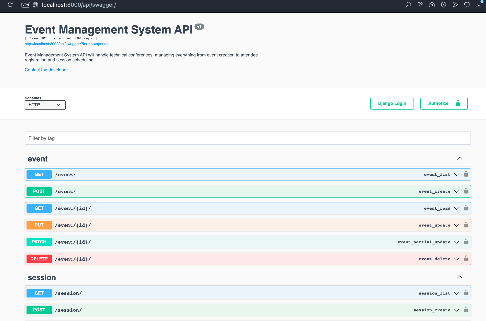
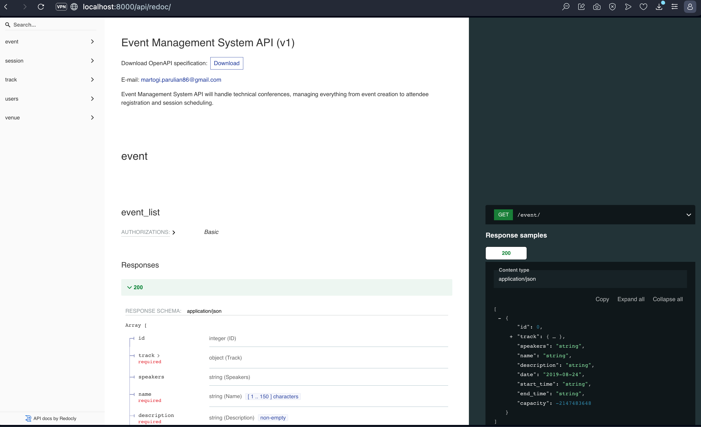

# Event Management System

## Overview
API for managing technical events and conferences using Django and Django REST Framework. This API
allow handle technical conferences, managing everything from event creation to attendee
registration and session scheduling.

## Features (requested)
1. Event Management
- [ ] Create, read, update, and delete events
- [ ] Track event capacity and venue details
- [ ] Handle event metadata (dates, descriptions, etc.)
2. Session Management
- [ ] Schedule sessions within events
- [ ] Prevent scheduling conflicts within tracks (requirement) 
- [ ] Manage speakers and time slots (requirement)
3. Attendee Registration
- [ ] Handle attendee registration
- [ ] Enforce event capacity limits
- [ ] Prevent duplicate registrations
4. Track Management
- [ ] Organize sessions into tracks
- [ ] Track creation and management

## Idea based on assumption from techinasia - Features (The one i worked on)
1. Event Management
- [ ] Create, read, update, and delete events
- [ ] Track event capacity and venue details
- [ ] Handle event metadata (dates, descriptions, etc.)
- [ ] Handling track and speaker time to avoid conflict
2. Session Management
- [ ] Schedule sessions within events
- [ ] Allowing events to be bundled as one or separate session and attendee will purchase / register into this session
3. Attendee Registration
- [ ] Handle attendee registration
- [ ] Enforce combined event capacity at session as limit 
- [ ] Prevent duplicate registrations
4. Track Management
- [ ] Organize sessions into tracks
- [ ] Track creation and management
5. User 
- [ ] Allowing admin / staff to do CRUD for Event - Session - Track
- [ ] Allowing to store speaker / attendee / user profile into one table profile. 
6. Speaker
- [ ] Allowing admin / staff to do CRUD for Speaker (model inside of session management app)
- [ ] Add restriction to not allow deletion of speaker attached to event 
<br/> <br/> 
TODO : allowing attendee / user to see their purchased session with information of the event that was included

### Requirements
<hr>

1. Django 5.0+
2. Django REST Framework
3. PostgreSQL
4. JWT authentication

### Local Configuration
<hr>

1. clone source code from github

2. go to project directory

   ```shell
   cd evms
   ```

3. create your own project env
   ```shell
   python3.10 -m venv env
   ```

4. activate your project env
   ``` shell
   source env/bin/activate
   ```

5. go to your project directory and install requirement.txt

   ```shell
   pip install requirement.txt
   ```
   
6. run docker compose

   ```shell
   docker compose up -d
   ```

7. migrate all models to database.

   ```shell
   python3.10 manage.py migrate
   ```
   
8. then run the apps.
   ```shell
   python3.10 manage.py runserver
   ```
   
### Run The Test and Coverage
<hr>

1. run test case.
   ```shell
   python3.10 manage.py test
   ```
   
   the output should be like this:
   ```shell
   Found 26 test(s).
   Creating test database for alias 'default'...
   System check identified no issues (0 silenced).
   ..........................
   ----------------------------------------------------------------------
   Ran 26 tests in 21.056s
   
   OK
   Destroying test database for alias 'default'...
   ```
   
2. run test coverage.
   ```shell
   coverage-3.10 run --source='.' manage.py test api
   coverage report
   ```
   
    the output should be like this:
   ```shell
   Found 26 test(s).
   Creating test database for alias 'default'...
   System check identified no issues (0 silenced).
   ..........................
   ----------------------------------------------------------------------
   Ran 26 tests in 25.189s
   
   OK
   Name                                                Stmts   Miss  Cover
   -----------------------------------------------------------------------
   api/__init__.py                                         0      0   100%
   api/session_management/__init__.py                      0      0   100%
   api/session_management/admin.py                         1      1     0%
   api/session_management/apps.py                          4      0   100%
   api/session_management/migrations/0001_initial.py       5      0   100%
   api/session_management/migrations/0002_initial.py       7      0   100%
   api/session_management/migrations/__init__.py           0      0   100%
   api/session_management/models.py                       42      4    90%
   api/session_management/serializers.py                 109      2    98%
   api/session_management/tests.py                       302      0   100%
   api/session_management/views.py                       143      7    95%
   api/track/__init__.py                                   0      0   100%
   api/track/admin.py                                      1      1     0%
   api/track/apps.py                                       4      0   100%
   api/track/migrations/0001_initial.py                    6      0   100%
   api/track/migrations/__init__.py                        0      0   100%
   api/track/models.py                                    22      2    91%
   api/track/serializers.py                               13      0   100%
   api/track/tests.py                                    112      0   100%
   api/track/views.py                                     12      0   100%
   api/urls.py                                            22      0   100%
   api/users/__init__.py                                   0      0   100%
   api/users/admin.py                                      1      1     0%
   api/users/apps.py                                       4      0   100%
   api/users/migrations/0001_initial.py                   10      0   100%
   api/users/migrations/__init__.py                        0      0   100%
   api/users/models.py                                    56     25    55%
   api/users/serializers.py                               59      5    92%
   api/users/tests.py                                     47      0   100%
   api/users/views.py                                     31      1    97%
   api/utils/__init__.py                                   0      0   100%
   api/utils/choices.py                                   12      0   100%
   api/utils/custom_jwt.py                                44     26    41%
   api/utils/fakers.py                                    81      7    91%
   api/utils/helpers.py                                   32     10    69%
   api/utils/permissions.py                               14      0   100%
   api/utils/serializers.py                                9      0   100%
   api/utils/validators.py                                14      2    86%
   evms/__init__.py                                        0      0   100%
   evms/asgi.py                                            4      4     0%
   evms/settings.py                                       22      0   100%
   evms/urls.py                                            2      0   100%
   evms/wsgi.py                                            4      4     0%
   manage.py                                              11      2    82%
   -----------------------------------------------------------------------
   TOTAL                                                1262    104    92%
   ```

### Postman
<hr>   
You can try API with postman by import the [Evms.postman_collection.json](Evms.postman_collection.json) and [Evms.postman_environment.json](Evms.postman_environment.json) file


### API Documentation (expected to be drf-spectacular but atm can use drf-yasg)
You can access API Documentation by accessing into web browser at
<br/>[localhost:8000/api/swagger/](http://localhost:8000/api/swagger/)
<br/>
 <br/>
 or at [localhost:8000/api/redoc/](http://localhost:8000/api/redoc/) <br/>
